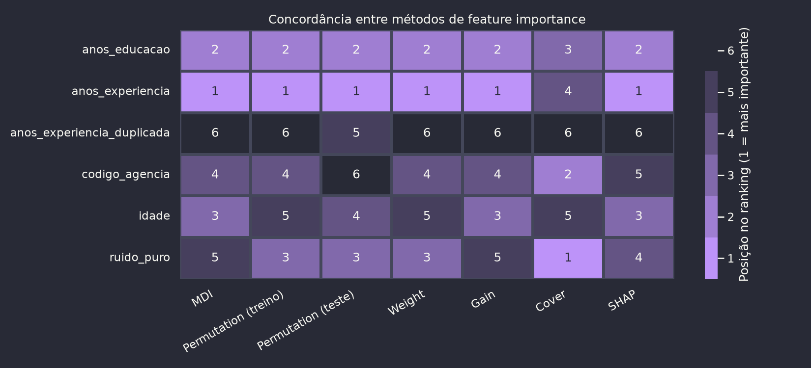

# Prática de Feature Importance em Árvores

Prática do Bloco 4 da trilha de seleção de features (StatQuest + *Advances in Financial Machine Learning*, cap. 8): comparar os métodos de feature importance em modelos de árvore, MDI, permutation importance (treino vs. teste), os três rankings do XGBoost (`weight`, `gain`, `cover`) e SHAP (TreeSHAP), sobre um dataset simulado com armadilhas plantadas de propósito.

Dataset de regressão simulado (renda mensal a partir de anos de experiência, educação e idade), com três armadilhas plantadas de propósito: ruído puro, uma categórica de alta cardinalidade aleatória (`codigo_agencia`) e uma feature duplicada de uma das fortes (`anos_experiencia_duplicada`). Modelo de árvore (XGBoost) treinado sobre todas as features, comparando MDI, permutation importance (treino vs. teste), os três rankings nativos do XGBoost (`weight`, `gain`, `cover`) e o ranking por média de |SHAP| (TreeSHAP).

## Estrutura

- `notebooks/feature_importance_arvores.ipynb`: notebook principal.
- `requirements.txt`: dependências Python do projeto.
- `outputs/`: gráficos gerados pelo notebook.

## Resultados



| Feature | MDI | Perm. treino | Perm. teste | Weight | Gain | Cover | SHAP |
|---|---|---|---|---|---|---|---|
| `anos_experiencia` | 1 | 1 | 1 | 1 | 1 | 4 | 1 |
| `anos_educacao` | 2 | 2 | 2 | 2 | 2 | 3 | 2 |
| `idade` | 3 | 5 | 4 | 5 | 3 | 5 | 3 |
| `ruido_puro` | 5 | 3 | 3 | 3 | 5 | 1 | 4 |
| `codigo_agencia` | 4 | 4 | 6 | 4 | 4 | 2 | 5 |
| `anos_experiencia_duplicada` | 6 | 6 | 5 | 6 | 6 | 6 | 6 |

*Posição no ranking de cada método (1º = mais importante).*

O ruído puro e a categórica de alta cardinalidade recebem importância comparável às features legítimas na maioria dos métodos calculados sobre o treino (MDI, permutation no treino, weight, gain). Só o permutation importance no **conjunto de teste** os derruba pra perto de zero, expondo o viés de treino. O caso mais grave é o `cover` do XGBoost, que inverte a hierarquia por completo: `ruido_puro` e `codigo_agencia` ficam nas duas primeiras posições, à frente de todas as features reais. O SHAP restaura a ordem correta entre features legítimas e armadilhas, mas não zera as duas armadilhas. Já a feature duplicada de `anos_experiencia` recebe importância zero em **todos** os métodos: a construção gulosa da árvore nunca divide o crédito entre colunas idênticas, ela simplesmente escolhe uma e ignora a outra.

Como o dataset é simulado e o mecanismo gerador do target é conhecido, não há risco de confundimento aqui: a importância não-nula das armadilhas reflete overfitting em amostra finita, não relação real. Discussão completa na seção 10 do notebook.

## Como rodar

> Convenção de commits: [Conventional Commits](https://www.conventionalcommits.org/) (`feat`, `fix`, `docs`, `refactor`, `chore`, etc.), uma etapa do notebook por commit e só depois de rodar sem erro, mantendo o histórico legível.

```bash
python3 -m venv .venv
source .venv/bin/activate
pip install -r requirements.txt
jupyter lab
```

## Licença

GPLv3. Ver [LICENSE](LICENSE).
